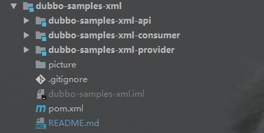

Dubbo 在 spring xml 形式的配置要比SpringBoot注解形式的配置 可读性要更友好。

因为Dubbo 是可以具体到方法级别的，使用xml配置起来更直观。（官方也推荐）

本文就来使用 Dubbo 2.7  整合 Spring。

项目结构如下：

项目依赖 `pom.xml` ：

## 1、Exception in thread "main" java.lang.IllegalStateException: Failed to check the status of the service org.apache.dubbo.samples.rest.api.facade.UserRestService. No provider available for the service xmlConfig/org.apache.dubbo.samples.rest.api.facade.UserRestService from the url rest,dubbo://172.16.44.48/org.apache.dubbo.samples.rest.api.facade.UserRestService?application=rest-consumer&dubbo=2.0.2&group=xmlConfig&interface=org.apache.dubbo.samples.rest.api.facade.UserRestService&metadata-type=remote&methods=getUser,registerUser&organization=dubbo&owner=programmer&pid=12556&protocol=rest,dubbo&register.ip=172.16.44.48&release=3.0.2.1&side=consumer&sticky=false&timestamp=1637657471176 to the consumer 172.16.44.48 use dubbo version 3.0.2.1

