使用的分析工具：

1、gc可视化工具：https://gceasy.io/

2、压测工具：jmeter（需要安装几个插件，在）


序列化：dubbo协议缺省为hessian2，rmi协议缺省为java，http协议缺省为json


使用 jmeter 官方自带的 servergent 收集服务器信息：

```
[root@GZSB-CJB-SHH10-8-LASTMILE-32 ServerAgent-2.2.3]# ./startAgent.sh 
INFO    2021-11-25 14:06:18.483 [kg.apc.p] (): Binding UDP to 4444
INFO    2021-11-25 14:06:19.490 [kg.apc.p] (): Binding TCP to 4444
INFO    2021-11-25 14:06:19.497 [kg.apc.p] (): JP@GC Agent v2.2.3 started
```

## 准备

压测思路：

压测consumer的Controller，调用provider暴露的接口。

provider做1w次循环，生成随机数做累加。

provider再把consumer的入参无处理返回给consumer。

consumer代码：

```java
   @DubboReference(version = "*", protocol = "dubbo,hessian", loadbalance = "random",retries = 0)
   private StressTestService stressTestService;
    
   @RequestMapping("/stressTest/string1k")
    public Boolean string1k(){
        // IO操作读取1k数据
        String s = new FileCapacity().getFileCapacity(1*1024);
        String result = stressTestService.StressString1k(s);
        log.info("stressTest/string1k:{},num:{}",result.length(),a);
        return true;
    }
```


## 1、Jmeter压测情况

环境：

provider:

```
jdk：1.8

2h4g

CentOS release 6.4 (Final)
model name      : QEMU Virtual CPU version 2.5+
stepping        : 3
cpu MHz         : 2099.998
cache size      : 4096 KB
```

宿主机带宽 ：

```
1G 
```

jvm参数：

```
-server -Xmx2g -Xms2g -Xmn256m -Xss256k -XX:+UseG1GC
```

jmeter参数：

```
20个并发线程1s内发出，持续 10分钟
```

cpu、内存、io、networkIO需通过 servergent 进行收集。

 

本次试验是不以压满provider为目标，只是单纯测试 10分钟的情况。

均采取 dubbo2.7.13+hessian2 ，压测10分钟，20并发，结果如下：

|                | 1K                                                           | 100K                                                         |
| -------------- | ------------------------------------------------------------ | ------------------------------------------------------------ |
| 样本（请求数） | 1298522                                                      | 79450                                                        |
| TPS            | 2164.2  ，1min到瓶颈<br />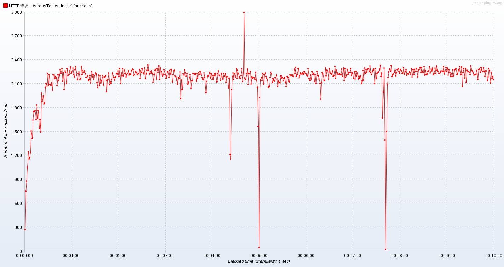 | 132.4 ；<br />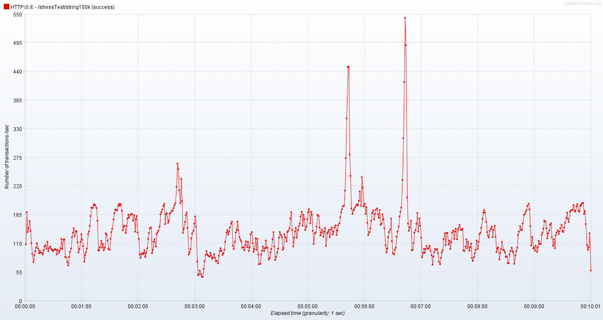       |
| 响应时间比例   | 90% 10ms；95% 11ms 99% 18ms，avg 8ms<br />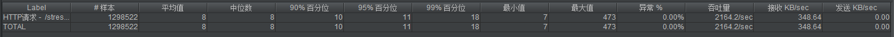 | 90% 213ms；95% 227ms ；99% 288ms<br />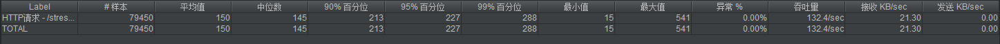 |
|                | 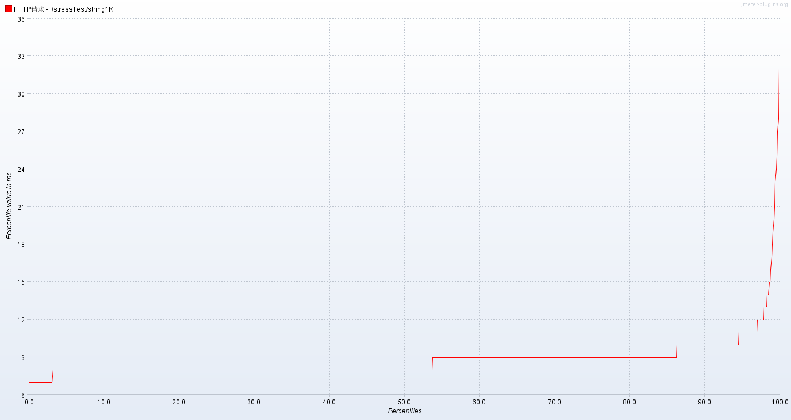                     | 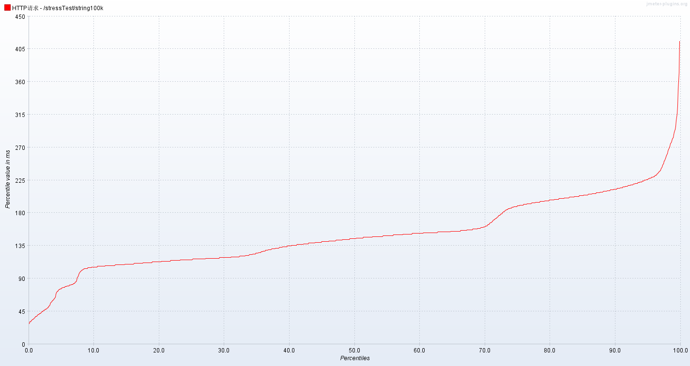                     |
| CPU            | 服务器 CPU：32%，内存 ： 21.6 %<br />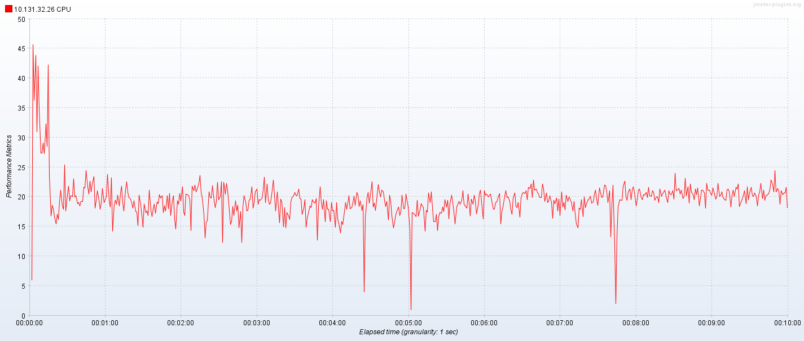 | %CPU 26.0 ; %MEM 16.5<br />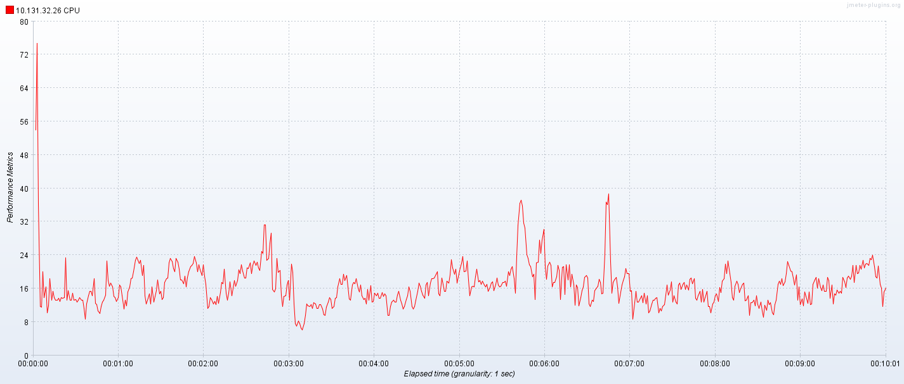 |
| IO             | 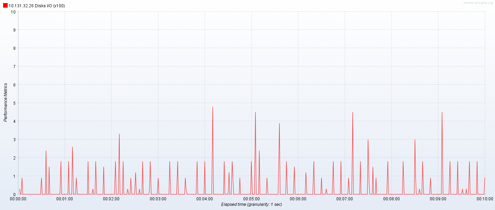 | 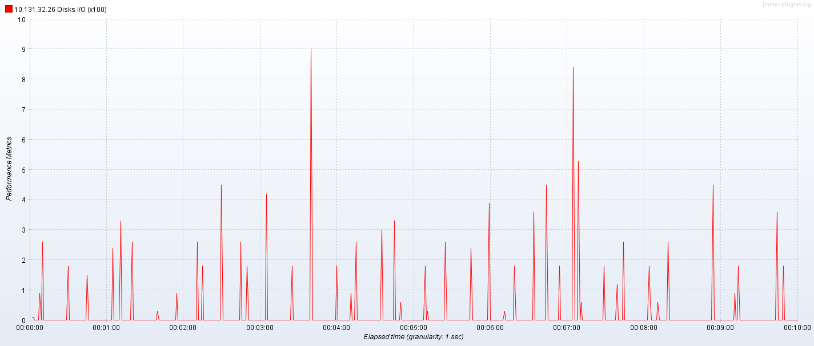                     |
| NetWork        | 2 800 000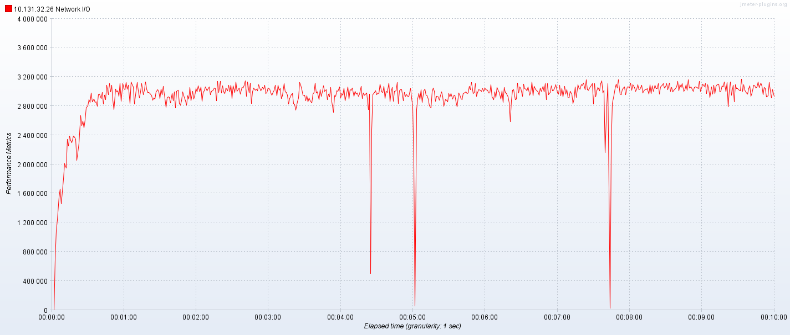            | 1 200 000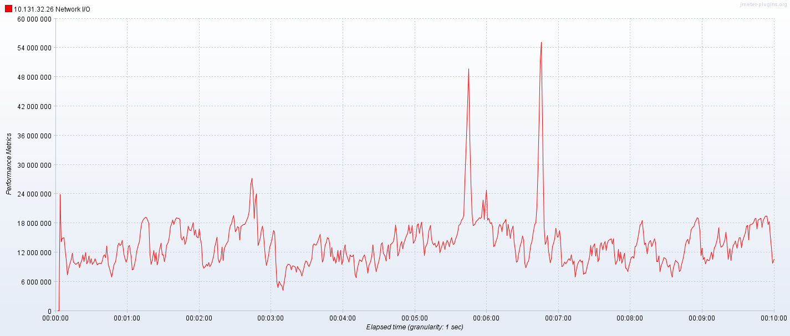            |
| 吞吐量         | 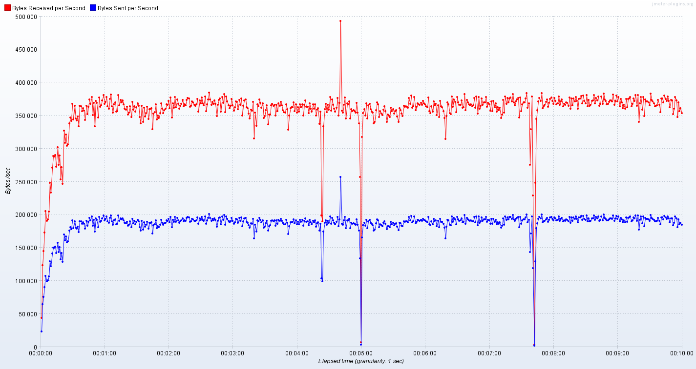                     | 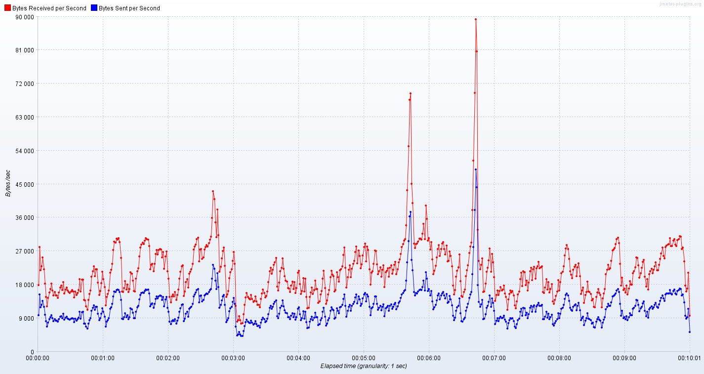                     |
| gc             | 1 sec 62 ms                                                  | 490 ms                                                       |
|                | 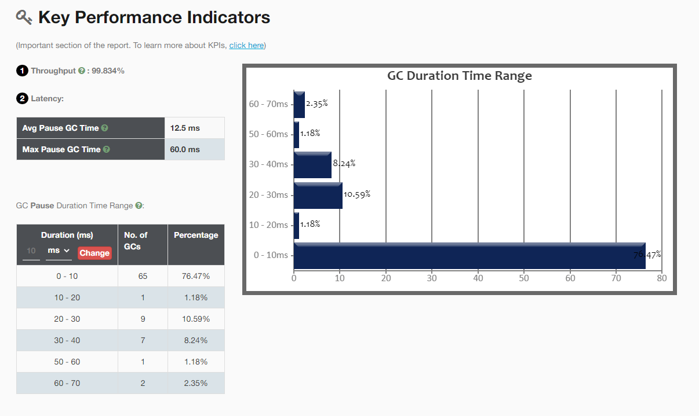                     | 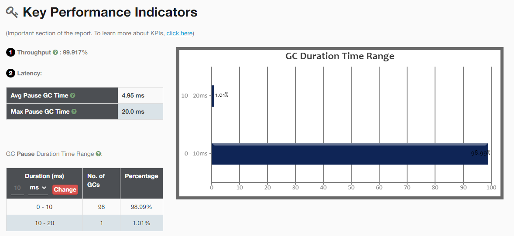                     |
|                | 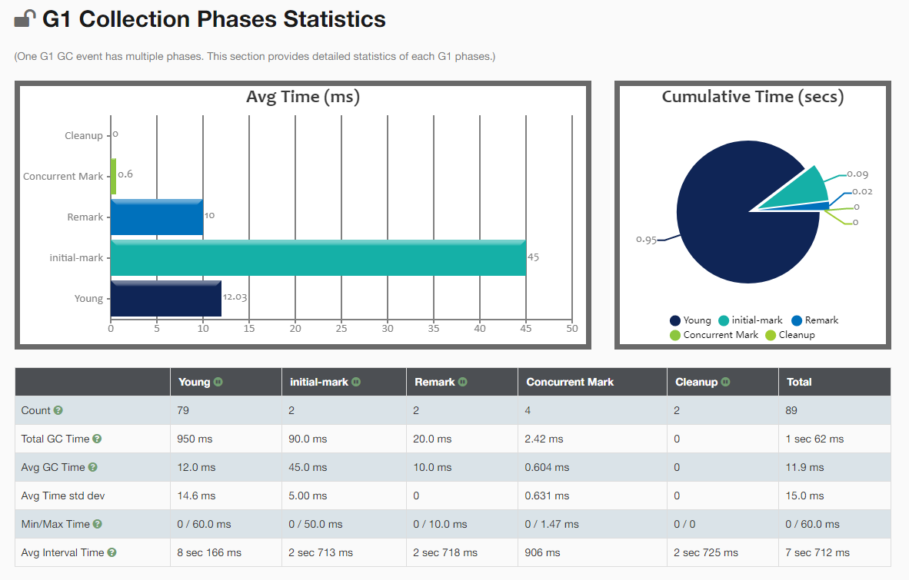                     |                                                              |


可以看到 100k 数据的时候，dubbo的响应时间很慢、tps也低。

>  consumer ping provider 延迟差不多是7ms
>
> 同机房延迟是 0.2ms


provider 在 1k 和 100k 的top：

- 1k

```
Tasks: 118 total,   1 running, 117 sleeping,   0 stopped,   0 zombie
Cpu0  : 23.6%us, 16.7%sy,  0.0%ni, 57.6%id,  0.3%wa,  0.0%hi,  1.7%si,  0.0%st
Cpu1  :  5.0%us,  7.7%sy,  0.0%ni, 87.3%id,  0.0%wa,  0.0%hi,  0.0%si,  0.0%st
Mem:   3924680k total,  3201900k used,   722780k free,   318184k buffers
Swap:  2097144k total,       64k used,  2097080k free,  1186712k cached

  PID USER      PR  NI  VIRT  RES  SHR S %CPU %MEM    TIME+  COMMAND                                                                                                       
19560 root      20   0 3834m 826m  13m S 33.3 21.6   0:43.04 java    
```

- 100k

```
top - 09:49:23 up 528 days, 17:07,  4 users,  load average: 0.16, 0.29, 0.21
Tasks:   1 total,   0 running,   1 sleeping,   0 stopped,   0 zombie
Cpu0  : 16.1%us,  2.1%sy,  0.0%ni, 80.7%id,  0.0%wa,  0.0%hi,  1.1%si,  0.0%st
Cpu1  :  8.1%us,  1.3%sy,  0.0%ni, 90.6%id,  0.0%wa,  0.0%hi,  0.0%si,  0.0%st
Mem:   3924680k total,  2971000k used,   953680k free,   320012k buffers
Swap:  2097144k total,       64k used,  2097080k free,  1185236k cached

  PID USER      PR  NI  VIRT  RES  SHR S %CPU %MEM    TIME+  COMMAND                                                                                                       
29635 root      20   0 4713m 632m  12m S 26.0 16.5   3:49.77 java
```


---

参考：

- 服务端的cpu、内存监测，下载：[https://www.cnblogs.com/imyalost/p/7751981.html](https://www.cnblogs.com/imyalost/p/7751981.html)
- jmeter版本和serverAgent版本问题：[https://www.cnblogs.com/SunshineKimi/p/11361216.html](https://www.cnblogs.com/SunshineKimi/p/11361216.html)